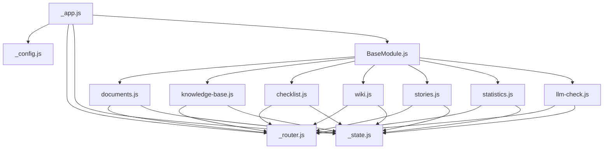

# 📗 Карта модулей TechCheck Pro

*Актуальная схема всех модулей системы | Версия: Сентябрь 2025*  
*Всего модулей: 11 (4 системных + 7 функциональных)*

## 📁 Структура модулей

```
TechCheck Pro/
│
├── 🔧 СИСТЕМНЫЕ МОДУЛИ (префикс _)
│   ├── _app.js          → Главный контроллер, загрузка модулей
│   │   └── API: init(), getModule(), registerModule(), log()
│   ├── _config.js       → Конфигурация системы  
│   │   └── API: get(), set(), getAll(), toggleTheme(), reset()
│   ├── _router.js       → Навигация и маршрутизация (hash-based)
│   │   └── API: navigate(), add(), back(), handleRoute()
│   └── _state.js        → Глобальное состояние и localStorage
│       └── API: get(), set(), subscribe(), getHistory(), reset()
│
├── 🏗️ БАЗОВЫЙ КЛАСС
│   └── BaseModule.js    → Родительский класс для всех модулей
│       ├── constructor(app) → Инициализация
│       ├── init()          → Автозапуск при загрузке  
│       ├── loadData()      → Загрузка данных
│       ├── renderContent() → Отрисовка интерфейса
│       ├── getPublicMethods() → API для других модулей
│       ├── getCache()      → Чтение из localStorage
│       ├── setCache()      → Запись в localStorage
│       ├── log()           → Логирование
│       └── emit()/on()     → События
│
└── 📦 ФУНКЦИОНАЛЬНЫЕ МОДУЛИ
    ├── documents.js     → Состав документации КБ
    │   ├── Зависимости: ['_state', '_router']
    │   ├── Версия: 1.0.0 | Статус: ready
    │   └── API: openDocument(), goBack()
    │
    ├── knowledge-base.js → База знаний ГОСТ
    │   ├── Зависимости: ['_state', '_router']  
    │   ├── Версия: 1.0.0 | Статус: ready
    │   └── API: search(), openCategory(), openArticle(), searchByTag()
    │
    ├── checklist.js     → Интерактивные чек-листы
    │   ├── Зависимости: ['_state', '_router']
    │   ├── Версия: 1.0.0 | Статус: ready
    │   └── API: openChecklist(), toggleCheck(), saveProgress(), generateReport()
    │
    ├── wiki.js          → База знаний команды  
    │   ├── Зависимости: ['_state', '_router']
    │   ├── Версия: 1.0.0 | Статус: beta
    │   └── API: createArticle(), searchArticles()
    │
    ├── stories.js       → Кейсы и обсуждения
    │   ├── Зависимости: ['_state', '_router']
    │   ├── Версия: 1.0.0 | Статус: beta
    │   └── API: createStory(), likeStory(), openComments()
    │
    ├── statistics.js    → Статистика и аналитика
    │   ├── Зависимости: ['_state', '_router']
    │   ├── Версия: 1.0.0 | Статус: soon
    │   └── API: exportReport(), refreshStats()
    │
    └── llm-check.js     → AI проверка (заглушка)
        ├── Зависимости: ['_state', '_router']
        ├── Версия: 1.0.0 | Статус: soon
        └── API: uploadFile(), startDemo(), subscribe()
```

## 🔧 Системные модули

### `_app.js` - Главный контроллер
```javascript
Версия: 1.0.0
Зависимости: нет
Отвечает за:
- Загрузку всех модулей
- Инициализацию приложения
- Debug режим
- Регистрацию модулей

Ключевые методы:
- init()              // Запуск приложения
- getModule(name)     // Получить модуль
- registerModule()    // Регистрация нового модуля
- log(message, type)  // Универсальный логгер
```

### `_config.js` - Конфигурация
```javascript
Версия: 1.0.0
Зависимости: ['_app']
Отвечает за:
- Хранение настроек
- Переключение темы
- Язык интерфейса
- API endpoints

Ключевые методы:
- get(key)           // Получить настройку
- set(key, value)    // Установить настройку
- toggleTheme()      // Переключить тему
- export/import()    // Экспорт/импорт конфига
```

### `_router.js` - Навигация
```javascript
Версия: 1.0.0
Зависимости: ['_app']
Отвечает за:
- Hash-based routing
- Навигацию между модулями
- Хлебные крошки
- История переходов

Ключевые методы:
- navigate(path)     // Перейти на страницу
- back()            // Назад
- add(path, handler) // Добавить маршрут
- getParams()       // Получить параметры URL
```

### `_state.js` - Состояние
```javascript
Версия: 1.0.0
Зависимости: ['_app']
Отвечает за:
- Глобальное состояние
- Синхронизация с localStorage
- Подписки на изменения
- История изменений

Ключевые методы:
- get(path)         // Получить значение
- set(path, value)  // Установить значение
- subscribe(path, callback) // Подписка
- getHistory()      // История изменений
```

## 📦 Функциональные модули

### `documents.js` - Состав документации
```javascript
Версия: 1.0.0
Зависимости: ['_state', '_router']
Статус: ready ✅
Навигация: Доступен только с главной

Отвечает за:
- Отображение 7 типов документов
- Описание каждого документа
- Навигация к чек-листам

API методы:
- openDocument(id)   // Открыть документ
- goBack()          // Вернуться к списку
```

### `knowledge-base.js` - База знаний
```javascript
Версия: 1.0.0
Зависимости: ['_state', '_router']
Статус: ready ✅
Навигация: /knowledge-base

Отвечает за:
- 8 категорий знаний
- Поиск по базе
- Просмотр статей
- Теги и фильтрация

API методы:
- search(query)      // Поиск
- openCategory(id)   // Открыть категорию
- openArticle(id)    // Открыть статью
- searchByTag(tag)   // Поиск по тегу
```

### `checklist.js` - Чек-листы
```javascript
Версия: 1.0.0
Зависимости: ['_state', '_router']
Статус: ready ✅
Навигация: /checklist

Отвечает за:
- 5 типов чек-листов
- Интерактивная проверка
- Сохранение прогресса
- Генерация отчетов

API методы:
- openChecklist(id)  // Открыть чек-лист
- toggleCheck()      // Отметить пункт
- saveProgress()     // Сохранить прогресс
- generateReport()   // Создать отчет
```

### `wiki.js` - Wiki команды
```javascript
Версия: 1.0.0
Зависимости: ['_state', '_router']
Статус: beta 🔶
Навигация: /wiki

Отвечает за:
- База знаний команды
- Инструкции
- Best practices
- FAQ

API методы:
- createArticle()    // Создать статью (заглушка)
- searchArticles()   // Поиск статей
```

### `stories.js` - Кейсы
```javascript
Версия: 1.0.0
Зависимости: ['_state', '_router']
Статус: beta 🔶
Навигация: /stories

Отвечает за:
- Кейсы проверок
- Обсуждения
- Лайки и комментарии
- Фильтрация по категориям

API методы:
- createStory()      // Создать историю (заглушка)
- likeStory(id)      // Лайк
- openComments(id)   // Комментарии (заглушка)
```

### `statistics.js` - Статистика
```javascript
Версия: 1.0.0
Зависимости: ['_state', '_router']
Статус: soon ⏳
Навигация: /statistics

Отвечает за:
- Графики проверок
- Топ ошибок
- Аналитика
- Экспорт отчетов

API методы:
- exportReport()     // Экспорт (заглушка)
- refreshStats()     // Обновить статистику
```

### `llm-check.js` - AI проверка
```javascript
Версия: 1.0.0
Зависимости: ['_state', '_router']
Статус: soon ⏳
Навигация: /llm-check

Отвечает за:
- Интерфейс AI проверки
- Демо режим
- Roadmap развития

API методы:
- uploadFile()       // Загрузка (заглушка)
- startDemo()        // Демо (заглушка)
- subscribe()        // Подписка (заглушка)
```

## 🔄 Граф зависимостей



## 📊 Статусы модулей

| Модуль | Статус | Версия | Готовность | Описание |
|--------|--------|---------|------------|----------|
| documents | ✅ ready | 1.0.0 | 100% | Полностью работает |
| knowledge-base | ✅ ready | 1.0.0 | 100% | Полностью работает |
| checklist | ✅ ready | 1.0.0 | 100% | Полностью работает |
| wiki | 🔶 beta | 1.0.0 | 70% | Базовый функционал |
| stories | 🔶 beta | 1.0.0 | 70% | Базовый функционал |
| statistics | ⏳ soon | 1.0.0 | 30% | Заглушка |
| llm-check | ⏳ soon | 1.0.0 | 10% | Заглушка |

## 💾 LocalStorage структура

```
techcheck_config         → Настройки приложения
techcheck_state          → Глобальное состояние
techcheck_documents      → Кэш модуля документов
techcheck_knowledge-base → Кэш базы знаний
techcheck_checklist      → Прогресс чек-листов (результаты проверок)
techcheck_wiki          → Статьи wiki
techcheck_stories       → Истории и кейсы
techcheck_statistics    → Данные статистики
```

## 🎨 Система логирования

### Цветовая схема консоли:
```javascript
⚙️ [system]   - Системные операции (синий #6366f1)
📦 [module]   - Загрузка модулей (голубой #3b82f6)  
✅ [success]  - Успешные операции (зеленый #10b981)
⚠️ [warning]  - Предупреждения (желтый #f59e0b)
❌ [error]    - Ошибки (красный #ef4444)
📝 [info]     - Информация (серый #64748b)
```

### Пример логов в консоли:
```
[11:20:55] ⚙️ App initialization started
[11:20:55] ✅ System module loaded: _config
[11:20:55] ✅ System module loaded: _router
[11:20:56] 📦 Module loaded: knowledge-base v1.0.0
[11:20:56] 🔄 Navigation: /knowledge-base
```

## 🚀 Как добавить новый модуль

1. **Создать файл** `new-module.js`
2. **Наследовать от BaseModule**
3. **Зарегистрировать в _app.js:**
   - Добавить в `moduleRegistry.functional`
   - Добавить в `moduleMeta`
4. **Обновить эту карту**

## 📝 Соглашения

### Именование
- Системные модули: `_название.js`
- Функциональные: `название-модуля.js`
- CSS классы: `.module-name-element`

### Версионирование
- Major.Minor.Patch (1.0.0)
- Major - критические изменения
- Minor - новый функционал
- Patch - исправления

### localStorage ключи
- `techcheck_` + название модуля
- Пример: `techcheck_checklist`

## 🔍 Быстрый поиск по методам

| Что искать | Где искать | Метод | Описание |
|------------|------------|--------|----------|
| Данные модуля | loadData() | В каждом модуле | Загрузка/инициализация данных |
| Интерфейс | renderContent() | В каждом модуле | Главный метод отрисовки |
| API модуля | getPublicMethods() | В каждом модуле | Публичные методы для других модулей |
| Настройки | _config.js | get/set | Глобальные настройки приложения |
| Навигация | _router.js | navigate() | Переход между страницами |
| Состояние | _state.js | get/set | Глобальное состояние |
| Кэш модуля | BaseModule | getCache/setCache | Работа с localStorage |

## 🔍 Debug режим

### Активация:
Добавьте `?debug=true` к URL: `http://localhost:8000/?debug=true`

### Что показывает:
- Все загруженные модули и их версии
- Граф зависимостей между модулями
- Текущее состояние приложения  
- История навигации
- Логи всех действий с временными метками
- Метрики производительности
- Размер кэша localStorage

### Debug панель (правый нижний угол):
```css
Позиция: fixed
Фон: rgba(0, 0, 0, 0.95)
Ширина: 400px
Высота: до 500px
```

## 📌 Важные замечания

1. **Системные модули** (с префиксом `_`) загружаются первыми
2. **Функциональные модули** всегда наследуют от `BaseModule`
3. **Все модули** обязательно регистрируются в `_app.js`
4. **Данные** сохраняются в localStorage с префиксом `techcheck_`
5. **API методы** доступны через `app.getModule('module-name').api`
6. **Навигация** только через hash-based routing (`#/module-name`)
7. **События** через глобальную шину `window.dispatchEvent`

---

*Обновляйте эту карту при добавлении новых модулей!*  
*Последняя проверка актуальности: Сентбрь 2025*
